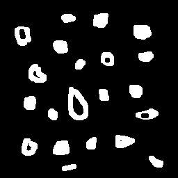

`#0d1117`
# Processamento Digital de Imagens.

> Essa página se destina a exibição de atividades propostas na disciplina de Processamento Digital de Imagens. 
A linguagem escolhida para implemnetação foi **Python**. 
Os códigos foram feitos na plataforma do **Google Colaboratory**, conhecido como **Colab**, portanto, algumas funcionalidade foram feitas de modo exclusivo para essa ferramenta. 
Por exemplo, como a plataforma não permite o uso do função _imshow_, utilizada para exibição da imagem pelo OpenCV, em alguns casos foi utilizado uma importação do propio Colab que permite a execução, de forma semelhante, pelo codigo *cv2_imshow*. Assumindo que as importações necessarias foram feitas, iremos diretamente as implementações.

## 1. Manipulando Pixels
1. A primeira atividade desta etapa se dá da seguinte forma: Será feito um tratamento de erro para o carregamento da imagem, verificando se o arquivo foi aberto corretamente, após isso a imagem é convertida em escala de cinza e, através da função _shape_ da numpy array, como é lido em Python, são lidos os atributos da imagem, sua altura e largura em pixels  estes serão usados para avisar ao usuario os limetes que podem ser digitados.

```
try:
  img=cv2.imread('/content/drive/MyDrive/Colab Notebooks/PDI/img/img.png')
except:
  print('Erro ao carregar imagem.')
else:
  print('Imagem carregada.')

img_g = cv2.cvtColor(img, cv2.COLOR_BGR2GRAY)

altura,largura=img_g.shape

print(f'As coordenadas devem estar entre (0,{altura}) e (0,{largura}).')

P1_x=int(input(f'Digite o primeiro ponto de coordenada P1: '))
P1_y=int(input(f'Digite o segundo ponto de coordenada P1: '))
P2_x=int(input(f'Digite o primeiro ponto de coordenada P2, maior que {P1_x}: '))
P2_y=int(input(f'Digite o segundo ponto de coordenada P2, maior que {P1_y}: '))

P1=(P1_x,P1_y)
P2=(P2_x,P2_y)
```
 Também é avisado ao usuario que o próximo valor para uma coordenada horizontal ou vertical deverá ser maior que o anterior, isto para a forma como o  códgio foi implementado.
Após as coordenadas serem dadas e considerar que o usuario tenha seguido as instruções, para o intervalo estabelecido é feito o negativo da imagem, ou seja, uma inversão das cores da imagem e, por fim, a imagem é exibida, através do seguinte codigo:
 ```
 for i in range(P1[0], P2[0]):
  for j in range(P1[1], P2[1]):
    img_g[i][j]= 255 - img_g[i][j]
cv2_imshow(img_g)
```


2. A segunda atividade propõe um algortimo que faça a troca de regiões de uma imagem. Para tal importamos a bibliotaca Numpy para utilizar da função **concatenate**, que permite agrupar uma sequencia a outra, esta foi necessaria pois foi feita a divisão da imagem em 4 partes, para então agrupar no formato solicitado.

```
#endereçando imagens
img_pA=img[0:int(altura/2), 0:int(largura/2)]
img_pB=img[0:int(altura/2),int(largura/2):largura]
img_pC=img[int(altura/2):altura, 0:int(largura/2)]
img_pD=img[int(altura/2):altura, int(largura/2):largura]

#criando linhas da nova matriz de imagem
img_trocada1=np.concatenate((img_pD,img_pB))
img_trocada2=np.concatenate((img_pC,img_pA))

#juntando em uma mesma linha
img_trocada=np.concatenate((img_trocada1,img_trocada2), axis=1)
cv2_imshow(img_trocada)
```

A imagem é dividida de acordo com seu tamanho de forma a gerar 4 novas imagens que a compõe, através dos parametros lidos anteriormente através da função shape. 
A última concatenção é feita com um parametro a mais que indica que deverá ser feita formando um segundo eixo. O resultado é o seguinte:


## 2. Preenchendo regiões
> Nesta parte é considerado que o código disponibilizado em C++ foi corretamente adaptado para Python e partiremos das atividades.
1. De modo semelhante, a segunda secção também há duas questões, sendo a primeira a questão da limitação do código ao valor de 255 para realizar o "degradê" na imagem. Buscando uma solução para esse limite a proposta é a seguinte: 
    - Ao perceber esses casos o algoritmos poderia reiniciar a ação e incrementar a escala de cinza somente a cada progressão em relação à 255, por exemplo, se tivesse o dobro (510), só incrementaria a cada 2 objetos. Portanto, seria verificado a quanridade de pixels na vertical, este seria dividido por 256, o resultado (convertido para inteiro), seria o _"passo"_ com que seria incremetado o valor.

2. Para a segunda questão, foi feita em duas partes.

Para a primeira parte foi usado o algortimo FloodFill nas linhas e colunas da imagem, fazendo com que os pontos que tocam a bordas, os quais não sabemos se contém buracos ou não, sejam desconsiderados.
```
for i in range (0,col): #colunas
  if img_nv_al[i][0] == 255:
    cv2.floodFill(img_nv_al,None,[0,i], 0)
  if img_nv_al[0][i] == 255:
    cv2.floodFill(img_nv_al,None,[i,0], 0)

for i in range (0,lin): #linhas
  if img_nv_al[i][255] == 255:
    cv2.floodFill(img_nv_al,None,[255,i], 0)
  if img_nv_al[255][i] == 255:
    cv2.floodFill(img_nv_al,None,[i,255], 0)
```
Gerando o seguinte resultado: 

 

Após isso alteramos o valor do funda para uma pequena diferença novamente com o FloodFill`cv2.floodFill(img_nv_al,None, (0,0), 1)`

Após isso é contado a quantidade total de bolhas, percorrendo todos os pixels da imagem, alterando todas para _150_, sempre que encontrava a cor original das bolhas. Fazendo com que as bolhas com buracos mantenham o espaço interno com o valor 0, podendo, agora que o fundo e as bolhas estão "evidenciados", buscar os buracos a partir do valor, sendo também alterado para que não corra o risco de ser contabilizado novamente. O resultado é o seguinte:


Dando o resuldado: 
Há 21 de objetos, dos quais, 7 tem bolhas e 14 estão sem bolhas. |
------


## 3. Manipulação de histograma
> Não foi possível fazer uso da web cam para captura da imagem, de modo que foi usado uma imagem estatica.
1. O histograma foi gerado a partir da imagem em gray scale, de modo que não foi necessario o uso de mais de um canal, mas caso houvesse a necessidade o procedimento teria pouca alteração, sendo repetido para cada canal. O procedimento de criar os histogramas do sistema RGB foi realizado, mas por questões de praticidade foi realizado com o gerado pela imagem em tons de cinza.
O histrograma original é:


A primeira atividade solicita que seja feita a equalização do histograma, o que foi realizado através da função da biblioteca OpenCV, que equaliza a imagem como todo e após isso extraimos o histograma da seguinte forma:
```
equali=cv2.equalizeHist(img_g)
hist=plt.hist(equali.ravel(),256,[0,256],)
```
O **plt** se refere a biblioteca Matplotlib.Pyplot, que permite a criação de histogramas. Apesar do OpenCV também disponibilizar a função, foi escolhida a outro por questões puramente esteticas, pois "preenche" todo o espaço a baixo dos pontos. O resulto da equilização, como esperado, diminiu a diferença entre quantidades de cores, deixando mais distribuido a intensidade do brilho, tendo o seguinte resultado:


2. Os passos para comparação dos histogramas foram simples. Toda vez que o codigo é executado o histograma anterior é salvo, o usuario pode entrar com uma nova imagem a partido do caminho `nova_img=str(input('Digite o caminho para a imagem que deseja usar o novo histograma: '))` e, como feito anteriormente, seu histograma é gerado e colodado lado a lado com o anterior, no mesmo gráfico, com a função `hstack` do Numpy.
Para o nosso caso foi usado a imagem Portadora.png do banco de imagens.


A comparação dos histogramas é feita a partir da função do OpenCV `compareHist` em que é posto os histogramas que serão comparados e o metódo que será utilizado e o retorno é o valor dessa comparação.
O limiar escolhido foi 0.3 e, através de um **if** comparamos o valor que, para este caso, não ultrapassou o limiar.

## 4. Filtragem no domínio espacial I

